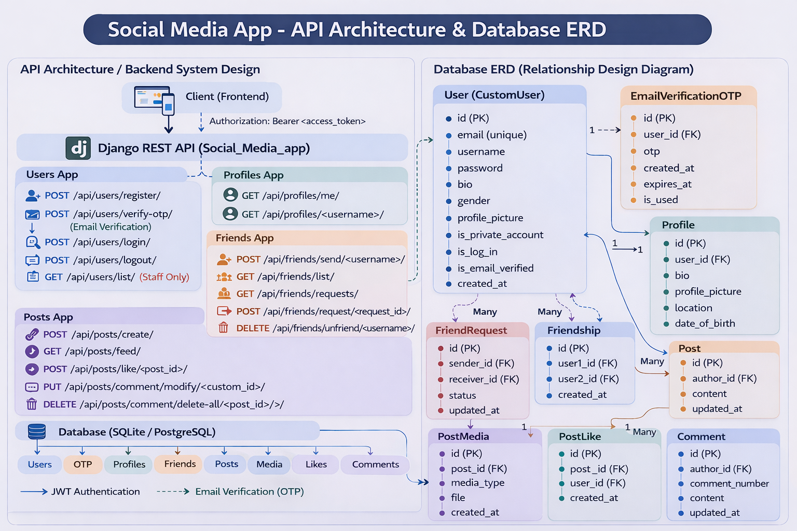

# Social Media Backend API

Backend API for a **Social Media platform** built with **Django** and 
**Django REST Framework**, with **JWT authentication** and **email 
verification** for user registration.

## Overview

This project is a Django REST API backend for a Social Media application 
that supports core networking features such as user authentication, 
profile management, friendships, and content sharing.

Built with Django, Django REST Framework, and JWT authentication, the 
system follows a modular architecture with dedicated apps for users, 
profiles, friends, and posts. Users register with email-based OTP 
verification, ensuring secure account activation before accessing the 
platform.

The API enables users to manage profiles, send and accept friend 
requests, create posts with media, and interact through likes and 
comments. The project emphasizes clean architecture, structured REST 
endpoints, and relational database design, making it a practical 
demonstration of scalable backend development for social platforms.

## Key Features

- Secure JWT-based authentication 
- Email OTP verification during registration 
- User profile management 
- Friend request and friendship system 
- Post creation with media support 
- Likes and comments on posts 
- Modular API architecture

## Tech Stack

- Backend: Django, Django REST Framework
- Authentication: JWT (SimpleJWT)
- Database: SQLite / PostgreSQL 
- Environment Management: python-dotenv 
- API Design: RESTful architecture

## Project Architecture

The backend follows a modular Django app structure, separating 
responsibilities across multiple components:

- Users App – Authentication, registration, and account management 
- Profiles App – User profile data and retrieval 
- Friends App – Friend requests and friendship relationships 
- Posts App – Post creation, media handling, likes, and comments 

This structure improves scalability, maintainability, and clarity in 
the codebase.

**This provides:**

-   User authentication with email verification via OTP and verification link
-   User profiles
-   Friend requests & friendships
-   Posts with media
-   Likes
-   Comments
-   Social feed

Authentication uses **JWT (SimpleJWT)**.

------------------------------------------------------------------------

# Base API URL

All endpoints follow this structure:

    /api/<app_name>/<endpoint>/

Example:

    /api/users/register/
    /api/users/login/
    /api/posts/feed/
    /api/friends/send/<username>/

------------------------------------------------------------------------

# Authentication

Authentication uses **JWT Tokens**.

After login, the API returns:

    access_token
    refresh_token

Frontend must send the access token in the request header:

    Authorization: Bearer <access_token>

### Endpoints that do NOT require authentication

- Register (requires email verification after registration)
- Login (will fail if email is not verified)
- Verify Email / OTP

All other endpoints require authentication.

------------------------------------------------------------------------

# Authentication Flow

Typical frontend workflow:

1.  Register user
2. Verify email using OTP or verification link 
3. Login 
4. Receive access and refresh tokens 
5. Store access token 
6. Send token in Authorization header

------------------------------------------------------------------------

# User Model Fields
|       Field        |                     Description                     |
|:------------------:|:---------------------------------------------------:|
|       email        |               Unique login identifier               |
|      username      |                   Public username                   |
|  profile_picture   |               Optional profile image                |
|        bio         |                   User biography                    |
|   date_of_birth    |                 Optional birth date                 |
|       gender       |                      M / F / O                      |
| is_private_account |                   Privacy control                   |
|     is_log_in      |                    Login status                     |
| is_email_verified  | Email verification status (True after verification) |
|     created_at     |                Account creation time                |

Login is performed using **email** instead of username.

------------------------------------------------------------------------

# Users API

## Register

    POST /api/users/register/

Request:

``` json
{
  "email": "name@email.com",
  "username": "username",
  "password": "Password123!",
  "password2": "Password123!",
  "bio": "Hello, I am learning",
  "gender": "M"
}
```
**Notes / Updates:**
- After registration, the user will receive an email with a verification link and OTP. 
- User cannot login until email is verified.

------------------------------------------------------------------------

## Verify Email / OTP

    POST /api/users/verify-otp/

Request:

``` json
{
    "email": "name@email.com",
    "otp": "123456"
}
```

Response:

``` json
{
    "message": "Email verified successfully"
}
```

**Notes / Updates:**

- OTP expires in 10 minutes. 
- After successful verification, is_email_verified is set to True. 

------------------------------------------------------------------------

## Login

    POST /api/users/login/

Request:

``` json
{
    "email": "testuser1@example.com",
    "password": "Password123!"
}
```

Response:

``` json
{
  "user": {
    "email": "testuser1@example.com",
    "username": "testuser1",
    "bio": "bio here",
    "gender": "M",
    "profile_picture": null, 
    "is_log_in": true,
    "is_email_verified": true
  },
  "refresh": "refresh_token_here",
  "access": "access_token_here"
}
```

**Notes:**

- Login will fail with an error if email is not verified. 

------------------------------------------------------------------------

## Logout

    POST /api/users/logout/

Requires authentication.

------------------------------------------------------------------------

## List Users (Staff Only)

    GET /api/users/list/

Accessible only to admin users.

------------------------------------------------------------------------

# Profiles API

## My Profile

    GET /api/profiles/me/

Returns the logged-in user's profile.

------------------------------------------------------------------------

## Edit My Profile

    PUT/PATCH /api/profiles/me/

Enables to edit the user's own profile.

------------------------------------------------------------------------


## User Profile

    GET /api/profiles/<username>/

Returns the profile of a specific user.

------------------------------------------------------------------------

# Friends System

## Send Friend Request

    POST /api/friends/send/<username>/

------------------------------------------------------------------------

## Friend Request Action

    POST /api/friends/request/<request_id>/

Request body:

``` json
{
  "action": "accept"
}
```

Possible values:

-   accept
-   reject
-   cancel

Rules:

-   accept / reject → receiver only
-   cancel → sender only

------------------------------------------------------------------------

## Pending Friend Requests

    GET /api/friends/requests/

------------------------------------------------------------------------

## Friend List

    GET /api/friends/list/

------------------------------------------------------------------------

## Unfriend

    POST /api/friends/unfriend/<username>/

------------------------------------------------------------------------

# Posts System

Posts may contain:

-   Text
-   Images
-   Videos
-   Multiple media files

Visibility levels:

    PUBLIC
    FRIENDS
    PRIVATE

------------------------------------------------------------------------

# Create Post

    POST /api/posts/create/

Content type:

    multipart/form-data

Fields:

|   Field    |            Type            |
|:----------:|:--------------------------:|
|  content   |            text            |
| visibility | PUBLIC / FRIENDS / PRIVATE |
|   media    |  file (multiple allowed)   |

Example:

    media=file1.jpg
    media=file2.png

------------------------------------------------------------------------

# Feed

    GET /api/posts/feed/

Feed includes:

-   User posts
-   Friends posts
-   Public posts

Sorted by:

    Newest first

Example response:

``` json
[
  {
    "id": 2,
    "author": 2,
    "author_name": "testuser1",
    "author_email": "testuser1@example.com",
    "content": "Multiple files Media post",
    "visibility": "FRIENDS",
    "media": [
      {
        "id": 1,
        "media_type": "IMAGE",
        "file": "/media/post_media/file.jpeg",
        "created_at": "2026-03-04T21:06:25Z"
      }
    ],
    "likes_count": 0,
    "comments_count": 0,
    "comments": [],
    "created_at": "2026-03-04T21:06:25Z"
  }
]
```

------------------------------------------------------------------------

# Likes

    POST /api/posts/like/<post_id>/

Adds a like to a post.

Note: Unlike is not implemented.

------------------------------------------------------------------------

# Comments

## Create Comment

    POST /api/posts/comment/<post_id>/

Request:

``` json
{
  "content": "This is my comment"
}
```

------------------------------------------------------------------------

## Modify Comment

    POST /api/posts/comment/modify/<custom_id>/

Custom ID format:

    postID-commentNumber

Example:

    1-1

Request:

``` json
{
  "content": "updated comment"
}
```

------------------------------------------------------------------------

## Delete All Post Comments

    DELETE /api/posts/comment/delete-all/<post_id>/

------------------------------------------------------------------------

# Media Upload

Media uploads use:

    multipart/form-data

Stored under:

    /media/post_media/

Frontend must prepend backend domain:

    https://domain.com/media/post_media/file.jpg

------------------------------------------------------------------------

# Permissions

|       Action        |   Permission    |
|:-------------------:|:---------------:|
|     Create post     |  Authenticated  |
|      Edit post      |   Post owner    |
|     Delete post     | Not implemented |
| Send friend request |  Authenticated  |
|   Accept request    |    Receiver     |
|   Reject request    |    Receiver     |
|   Cancel request    |     Sender      |

------------------------------------------------------------------------

# Pagination

Currently pagination is **not implemented**.

------------------------------------------------------------------------

# Error Codes

| Code | Meaning      |
|------|--------------|
| 200  | Success      |
| 201  | Created      |
| 400  | Bad Request  |
| 401  | Unauthorized |
| 403  | Forbidden    |
| 404  | Not Found    |
| 500  | Server Error |

------------------------------------------------------------------------

# Backend Stack

- Django 
- Django REST Framework 
- SimpleJWT 
- python-dotenv (for environment variables)
- SQLite (development)

------------------------------------------------------------------------

# Complete API Endpoints Table

All endpoints require authentication except Register and Login.

Authentication header:

    Authorization: Bearer <access_token>

## Authentication & Users API

| Method | Endpoint                 | Description                                                       | Auth Required |
|--------|--------------------------|-------------------------------------------------------------------|---------------|
| POST   | `/api/users/register/`   | Register a new user account (email verification required)         | ❌             |
| POST   | `/api/users/verify-otp/` | Verify email using OTP sent to user email                         | ❌             |
| POST   | `/api/users/login/`      | Login user and receive JWT tokens (blocked if email not verified) | ❌             |
| POST   | `/api/users/logout/`     | Logout user (invalidate token)                                    | ✅             |
| GET    | `/api/users/list/`       | List all users (Staff only)                                       | ✅             |

## Profiles API

| Method    | Endpoint                    | Description                   | Auth Required |
|-----------| --------------------------- |-------------------------------| ------------- |
| GET       | `/api/profiles/me/`         | Get logged-in user's profile  | ✅             |
| PUT/PATCH | `/api/profiles/me/`         | Edit logged-in user's profile | ✅             |
| GET       | `/api/profiles/<username>/` | Get another user's profile    | ✅             |

## Friends System API

| Method | Endpoint                             | Description                      | Auth Required |
| ------ | ------------------------------------ | -------------------------------- | ------------- |
| POST   | `/api/friends/send/<username>/`      | Send friend request              | ✅             |
| GET    | `/api/friends/list/`                 | Get user's friend list           | ✅             |
| GET    | `/api/friends/requests/`             | Get pending friend requests      | ✅             |
| POST   | `/api/friends/request/<request_id>/` | Accept / Reject / Cancel request | ✅             |
| DELETE | `/api/friends/unfriend/<username>/`  | Remove friend                    | ✅             |

### Friend Request Actions

Request Body:

``` json
{
  "action": "accept"
}
```

Possible values:

    accept
    reject
    cancel

## Posts API

| Method | Endpoint                                   | Description                    | Auth Required |
| ------ | ------------------------------------------ | ------------------------------ | ------------- |
| POST   | `/api/posts/create/`                       | Create a post (text or media)  | ✅             |
| GET    | `/api/posts/feed/`                         | Get feed (own + friends posts) | ✅             |
| POST   | `/api/posts/like/<post_id>/`               | Like a post                    | ✅             |
| POST   | `/api/posts/comment/<post_id>/`            | Create comment on post         | ✅             |
| PUT    | `/api/posts/comment/modify/<custom_id>/`   | Update comment                 | ✅             |
| DELETE | `/api/posts/comment/delete-all/<post_id>/` | Delete all comments on a post  | ✅             |

### Comment Custom ID Format

Comments use a custom identifier:

    postID-commentNumber

Example:

    1-1
    1-2
    2-1

Meaning:

    <PostID>-<CommentNumber>

### Media Upload

Posts support multiple media uploads.

Field name:

    media

Content-Type:

    multipart/form-data

Example request fields:

| Field      | Type |
| ---------- | ---- |
| content    | text |
| visibility | text |
| media      | file |

Example:

    media: image1.jpg
    media: image2.jpg
    media: video1.mp4

### Feed Logic

Feed returns:

    1. User's own posts
    2. Friends posts
    3. Only posts allowed by visibility rules

Visibility options:

    PUBLIC
    FRIENDS
    PRIVATE

Feed is ordered:

    Newest first

## Example Feed Response

``` json
[
  {
    "id": 2,
    "author": 2,
    "author_name": "testuser1",
    "author_email": "testuser1@example.com",
    "content": "Multiple files Media post",
    "visibility": "FRIENDS",
    "media": [
      {
        "id": 1,
        "media_type": "IMAGE",
        "file": "/media/post_media/example.jpg",
        "created_at": "2026-03-04T21:06:25Z"
      }
    ],
    "likes_count": 0,
    "comments_count": 0,
    "comments": [],
    "created_at": "2026-03-04T21:06:25Z",
    "updated_at": "2026-03-04T21:06:25Z"
  }
]
```

------------------------------------------------------------------------

# Postman Collection Documentation

Below is the collection structure.

## Collection Name

    Social Media API

## Folder Structure

1- Authentication:

    POST Register
    POST Verify OTP
    POST Login 
    POST Logout 
    GET Users List

2- Profiles:

    GET My Profile
    PUT/PATCH Edit My Profile
    GET User Profile

3- Friends:

    POST Send Friend Request
    GET Friend List
    GET Pending Requests
    POST Accept/Reject/Cancel Request
    DELETE Unfriend

4- Posts:

    POST Create Post
    GET Feed
    POST Like Post
    POST Comment Post
    PUT Modify Comment
    DELETE Delete All Comments

## Example Postman Request

### Register

POST

    /api/users/register/

Body:

``` json
{
  "email": "user@test.com",
  "username": "testuser",
  "password": "Password123!",
  "password2": "Password123!",
  "bio": "Hello world",
  "gender": "M"
}
```
**Note:** After registration, the user will not be able to login 
until email verification is completed. An OTP is sent to the 
provided email.

### Verify OTP

POST

    /api/users/verify-otp/

Body:

``` json
{
  "email": "user@test.com",
  "otp": "123456"
}
```

Response:

``` json
{
  "message": "Email verified successfully",
  "email": "user@test.com"
}
```

### Login

POST

    /api/users/login/

Body:

``` json
{
  "email": "user@test.com",
  "password": "Password123!"
}
```

> **Important:** Login will fail with an error if the email has not yet 
been verified.  

Response:

``` json
{
  "user": {
    "email": "user@test.com",
    "username": "testuser",
    "bio": "Hello world",
    "gender": "M",
    "profile_picture": null,
    "is_log_in": true,
    "is_email_verified": true
  },
  "refresh": "token",
  "access": "token"
}
```

### Authorization Setup in Postman

After login:

    Authorization
    Type: Bearer Token
    Token: <access_token>

### Create Post (Postman)

POST

    /api/posts/create/

- Body → form-data

| Key        | Type | Value         |
| ---------- | ---- | ------------- |
| content    | Text | My first post |
| visibility | Text | FRIENDS       |
| media      | File | image.jpg     |

### Like Post

POST

    /api/posts/like/1/

No body required.

### Comment Post

POST

    /api/posts/comment/1/

Body:

``` json
{
  "content": "Nice post!"
}
```

### Modify Comment

PUT

    /api/posts/comment/modify/1-1/

``` json
{
  "content": "Updated comment"
}
```

### Delete All Post Comments

DELETE

    /api/posts/comment/delete-all/1/

## Recommended Postman Environment Variables

| Variable      | Example                      |
| ------------- | ---------------------------- |
| base_url      | `https://yourdomain.com/api` |
| access_token  | JWT token                    |
| refresh_token | JWT refresh token            |

Example usage:

    {{base_url}}/posts/feed/

## API Architecture & Database ERD



## API Architecture/Backend System Design

``` json
Client (Frontend)
   |
   |--- Authorization: Bearer <access_token>
   |
Django REST API (Social_Media_app)
   |
   |--- Users App
   |       |-- /register
   |       |-- /verify-otp
   |       |-- /login
   |       |-- /logout
   |       |-- /list (Staff only)
   |
   |--- Profiles App
   |       |-- /me/
   |       |-- /<username>/
   |
   |--- Friends App
   |       |-- /send/<username>/
   |       |-- /list/
   |       |-- /requests/
   |       |-- /request/<request_id>/
   |       |-- /unfriend/<username>/
   |
   |--- Posts App
           |-- /create/
           |-- /feed/
           |-- /like/<post_id>/
           |-- /comment/<post_id>/
           |-- /comment/modify/<custom_id>/
           |-- /comment/delete-all/<post_id>/

Database (SQLite/PostgreSQL)
   |--- Users Table
   |       |-- is_email_verified 
   |--- EmailVerificationOTP Table
   |--- Profiles Table
   |--- Friends Table
   |--- FriendRequests Table
   |--- Posts Table
   |--- PostMedia Table
   |--- PostLikes Table
   |--- Comments Table
```

## Relationship Design Diagram

``` json
User (CustomUser)
  - id (PK)
  - email (unique)
  - username
  - password
  - bio
  - gender
  - profile_picture
  - is_private_account
  - is_log_in
  - is_email_verified
  - created_at

EmailVerificationOTP
  - id (PK)
  - user_id (FK → User.id)
  - otp
  - created_at
  - expires_at
  - is_used 

Profile
  - id (PK)
  - user_id (FK → User.id, 1:1)
  - bio
  - profile_picture
  - location
  - date_of_birth
  - created_at

FriendRequest
  - id (PK)
  - sender_id (FK → User.id)
  - receiver_id (FK → User.id)
  - status
  - created_at
  - updated_at
  - UNIQUE(sender_id, receiver_id)

Friendship
  - id (PK)
  - user1_id (FK → User.id)
  - user2_id (FK → User.id)
  - created_at
  - UNIQUE(user1_id, user2_id)

Post
  - id (PK)
  - author_id (FK → User.id)
  - content
  - visibility
  - created_at
  - updated_at

PostMedia
  - id (PK)
  - post_id (FK → Post.id)
  - media_type
  - file
  - created_at

PostLike
  - id (PK)
  - post_id (FK → Post.id)
  - user_id (FK → User.id)
  - created_at
  - UNIQUE(post_id, user_id)

Comment
  - id (PK)
  - post_id (FK → Post.id)
  - author_id (FK → User.id)
  - comment_number
  - content
  - created_at
  - updated_at
  - UNIQUE(post_id, comment_number)
```

------------------------------------------------------------------------

# Installation

```bash
# Clone repository
git clone https://github.com/Ahmad-Ali016/Social-Media-deployment.git

# Create virtual environment
python -m venv venv
source venv/bin/activate  # Linux/macOS
venv\Scripts\activate     # Windows

# Install requirements
pip install -r requirements.txt

# Run migrations
python manage.py makemigrations
python manage.py migrate

# Create superuser
python manage.py createsuperuser

# Run server
python manage.py runserver
```

------------------------------------------------------------------------
# Future Improvements

-   Pagination
-   Unlike functionality
-   Edit post endpoint
-   Delete single comment
-   CORS configuration
-   Notifications
-   Real‑time messaging
